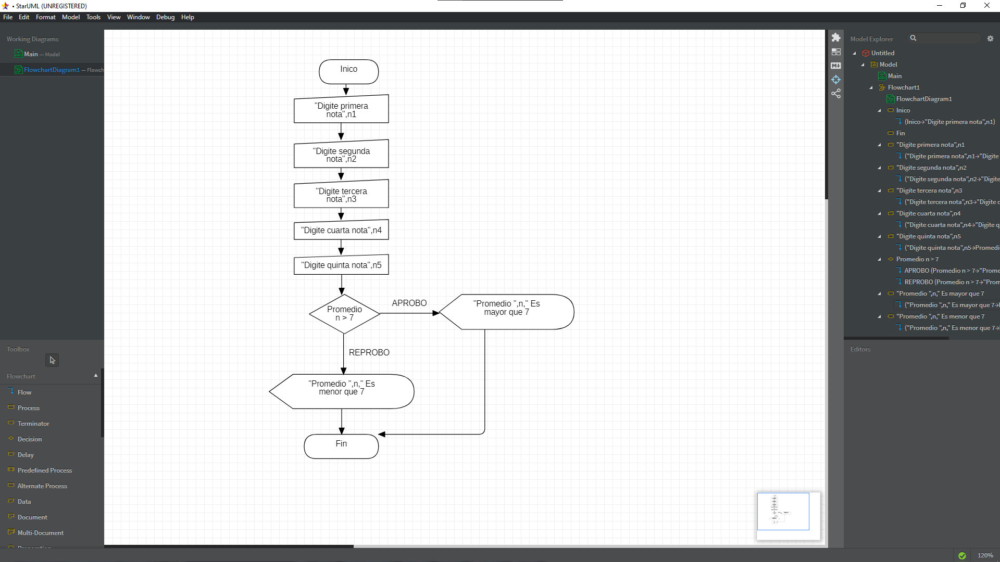

# CLASE SEPTIEMBRE 13

Actividad de sacar un promedio y parte logica de eleccion de decisiones

##  CODIGO DE PRUEBA EN EXCEL -VISUAL BASIC-

```
Sub inicio()
       MsgBox "CALCULAR PROMEDIO DEL ESTUDIANTE"
       n1 = Int(InputBox("PRIMERA NOTA"))
       n2 = Int(InputBox("SEGUNDA NOTA"))
       n3 = Int(InputBox("TERCERA NOTA"))
       n4 = Int(InputBox("CUARTA NOTA"))
       n5 = Int(InputBox("QUINTA NOTA"))
       d = n1 + n2 + n3 + n4 + n5
       t = d / 5
       MsgBox "LA SUMA DE LAS NOTAS ES  " & d
       If (t > 7) Then
           MsgBox "EL PROMEDIO ES  " & t & "  El ESTADO DEL ESTUDIANTE ES APROBO"
       Else
           MsgBox "EL PROMEDIO ES  " & t & "  EL ESTADO DEL ESTUDIANTE ES REPROBADO"
       End If
   End Sub

```


## CODIGO EN -DART-

```
void main() {
 int  n = 8;

  if (n > 10){
    print("El promedio del estudiante $n es mayor que 10 (APROBADO)");
  }else{
    print("El promedio del estudiante $n es menor o igual que 10 (REPROBADO)");
  }

}

```

## CODIGO EN -ATOM-

```
inicio
  lea "Escriba numero", n
  Si n > 10 entonces
      escriba "el numero ", n, "Es mayor que 10"
  Sino
      escriba "El numero ", n, "Es menor o igual a 10"
  Fin si
fin

## DIAGRAMA DE FLUJO -STARUML

```


#DIAGRAMA DE -FLUJO-

  
