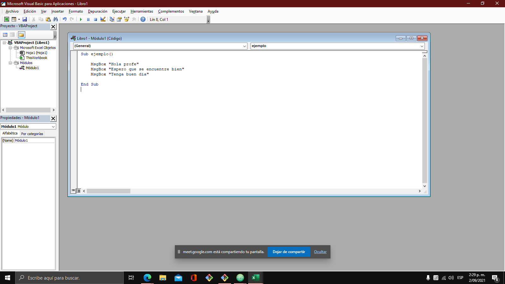
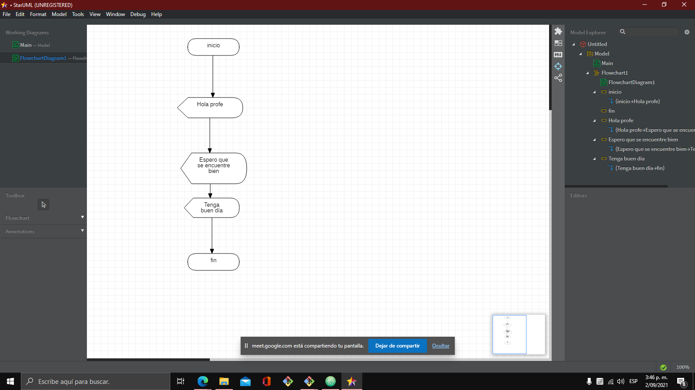

# Clase septiembre 2 del 2021

## Conocimientos sobre la clase de hoy

Aprendimos sobre las variables y realizó los siguientes ejercicios

## Ejercicio de excel

```
Sub ejemplo()

    MsgBox "Hola profe"
    MsgBox "Espero que se encuentre bien"
    MsgBox "Tenga buen dia"

End Sub

```




