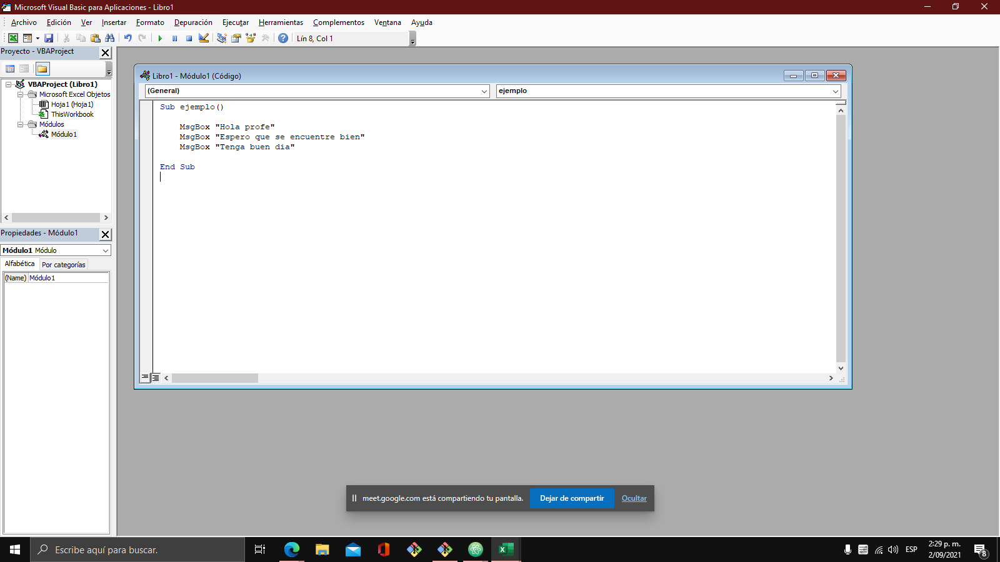
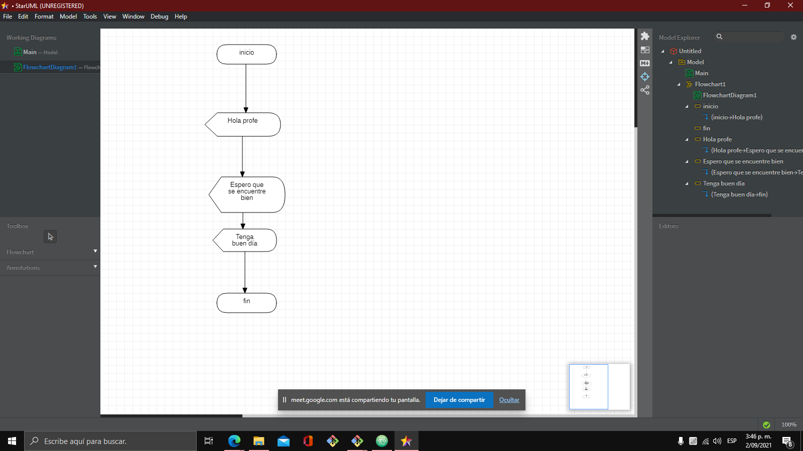

# Clase septiembre 2 del 2021

## Conocimientos sobre la clase de hoy

Aprendimos sobre las variables y realizó los siguientes ejercicios

## Ejercicio de excel

```
Sub ejemplo()

    MsgBox "Hola profe"
    MsgBox "Espero que se encuentre bien"
    MsgBox "Tenga buen dia"

End Sub

```






#Clase septiembre 9 del 2021
Aprendimos en día de hoy sobre como crear un programa que nos de el porcentaje de varios números

## Ejercicio de excel
```
Sub ejemplo()

    a = InputBox("colocar primer numero")
    b = InputBox("colocar segundo numero")
    c = InputBox("colocar tercer numero")
    d = InputBox("colocar cuarto numero")
    e = Int(a) + Int(b) + Int(c) + Int(d)
    MsgBox "El promedio es" & e / 4


End Sub

```


